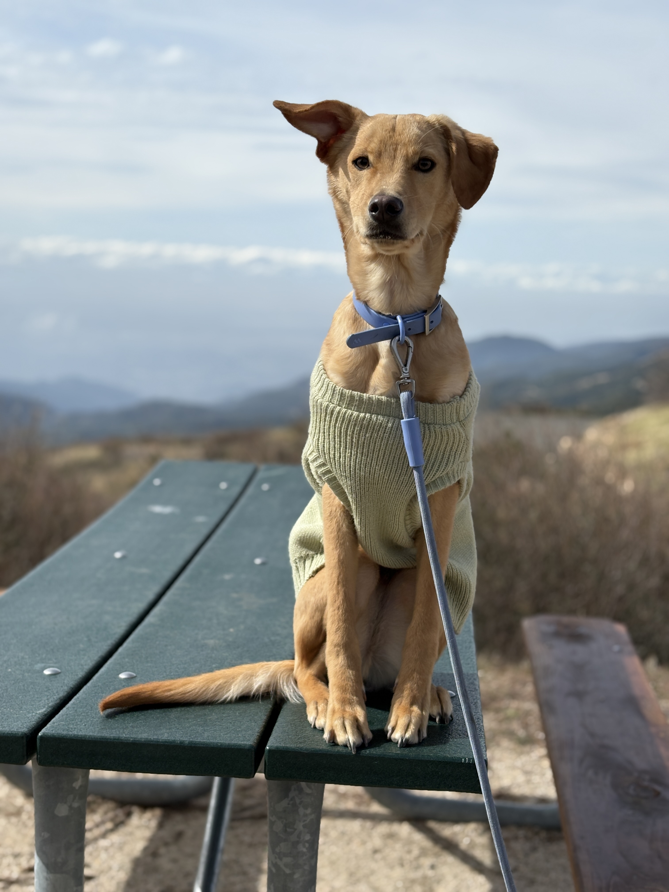
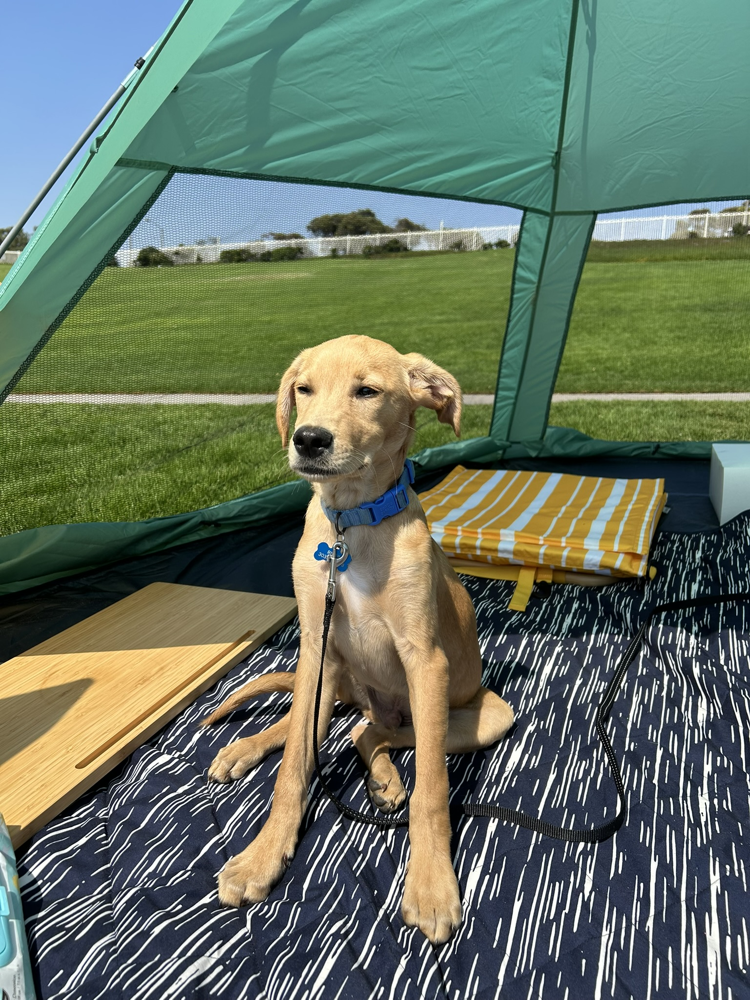
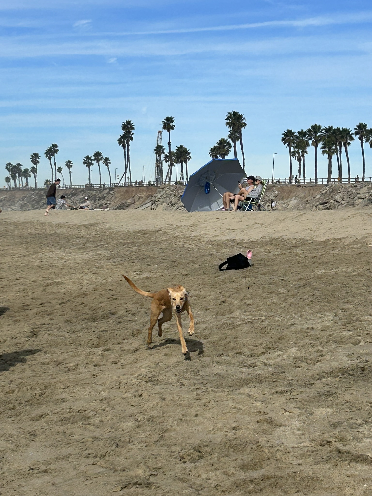
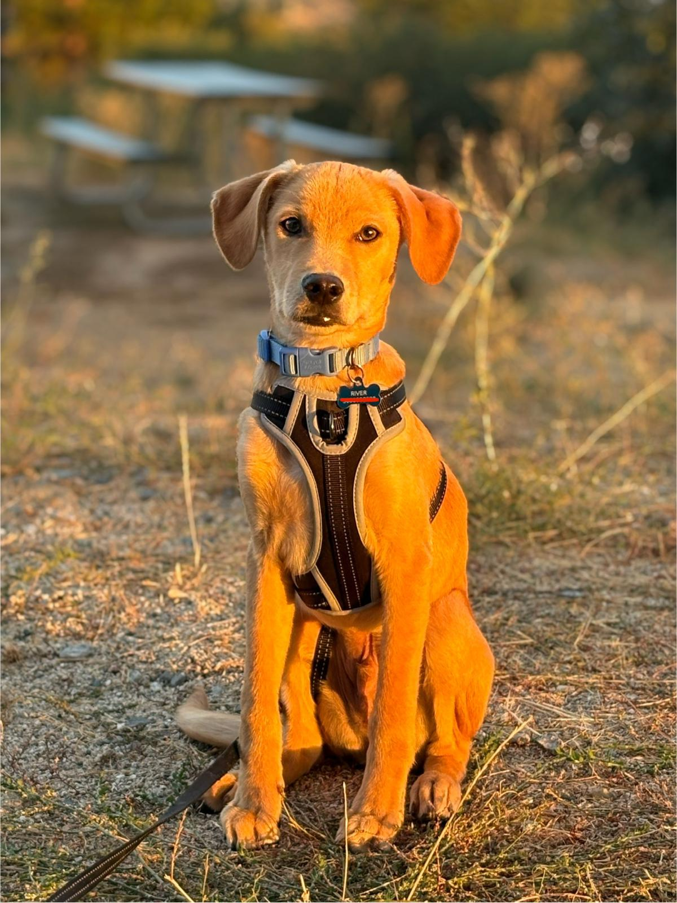
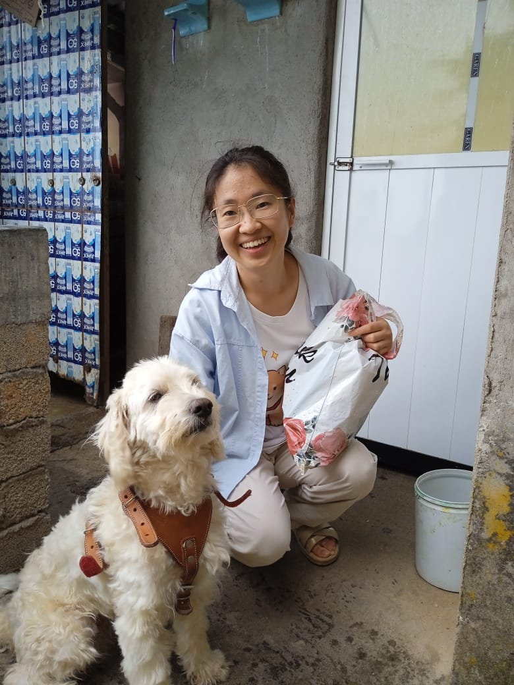
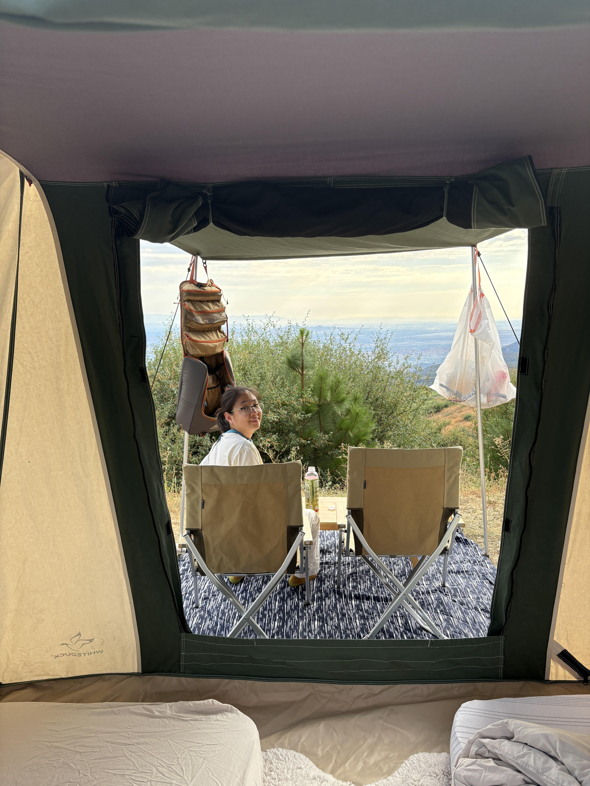
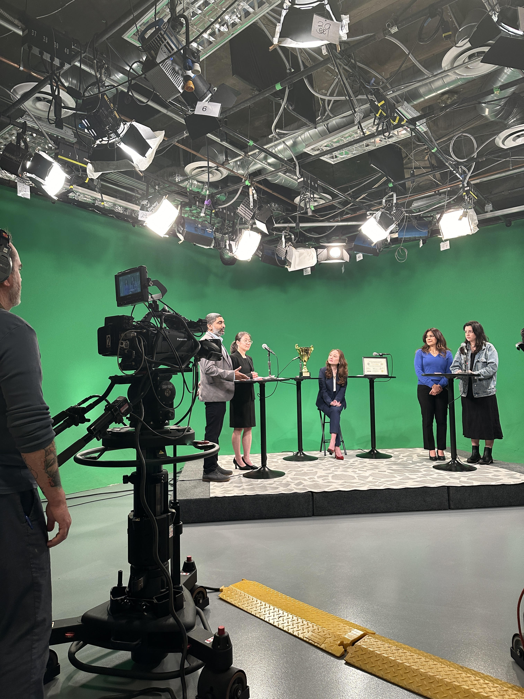

```{r setup, include=FALSE}
knitr::opts_chunk$set(echo = TRUE)

```

\  
\  
<div style="text-align: center;">

  <!-- wrapper: width equals the image row -->
  <div style="display: inline-block; text-align: left;">

  <p style="margin: 0 0 14px 0;font-size: 18px;">
  Meet my dog River! His Chinese name is 陈皮水 [tʂɛn ˧˥ pi ˧˥ ʂui ˨˩˧] "Tangerine Peel", Spanish name Rio, Zapotec name Yego [jègó] (which also means "River").
  <br><br>
  River was born in Tijuana on March 17, 2025. He loves camping, hiking, playing fetch, sleeping and making new dog friends. And of course, he has an unwavering love for treats and any human food he can get.
  </p>

  <div style="display: flex; justify-content: center; gap: 20px; flex-wrap: nowrap;">

  <figure style="margin: 0; width: 220px; text-align: center;">
  
  <figcaption>in San Bernandino Mountains, CA</figcaption>
  </figure>

  <figure style="margin: 0; width: 220px; text-align: center;">
  
  <figcaption>in Salt Creek Beach Park, CA</figcaption>
  </figure>

  <figure style="margin: 0; width: 220px; text-align: center;">
  
  <figcaption>at Huntington Dog Beach, CA</figcaption>
  </figure>

  <figure style="margin: 0; width: 220px; text-align: center;">
  
  <figcaption>in Skypark At Santa's Village, CA</figcaption>
  </figure>

  </div>

  </div>
  
  <br>
  <br>

  
  <!-- wrapper: width equals the image row -->
  <div style="display: inline-block; text-align: left;">

  <p style="margin: 0 0 14px 0;font-size: 18px;">
  As for me, you can also find me in the field with my furiends, in the mountains, and sometimes on stage for a statistics-methods contest!
  </p>

  <div style="display: flex; justify-content: center; gap: 20px; flex-wrap: nowrap;">

  <figure style="margin: 0; width: 220px; text-align: center;">
  
  <figcaption>in San Francisco Yateé, Oaxaca, with Donul</figcaption>
  </figure>

  <figure style="margin: 0; width: 220px; text-align: center;">
  
  <figcaption>in San Francisco Yateé, Oaxaca, with Oso Panda</figcaption>
  </figure>

  <figure style="margin: 0; width: 220px; text-align: center;">
  
  <figcaption>in San Bernandino Mountains, CA</figcaption>
  </figure>

  <figure style="margin: 0; width: 220px; text-align: center;">
  
  <figcaption>at Pasadena Media’s television studio, CA</figcaption>
  </figure>

  </div>

  </div>

</div>
