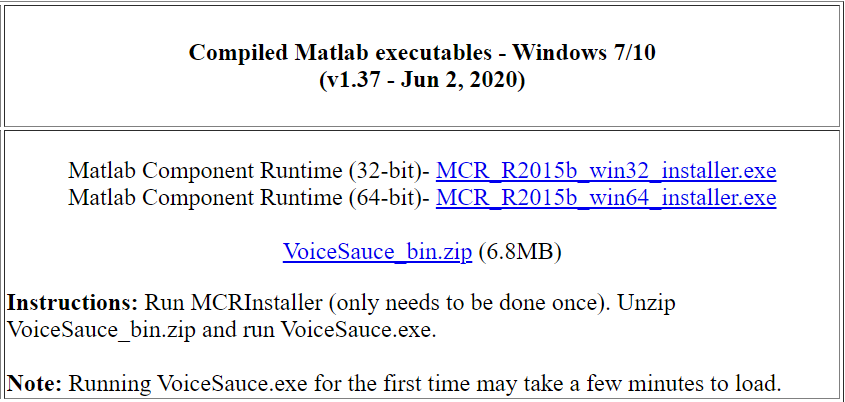
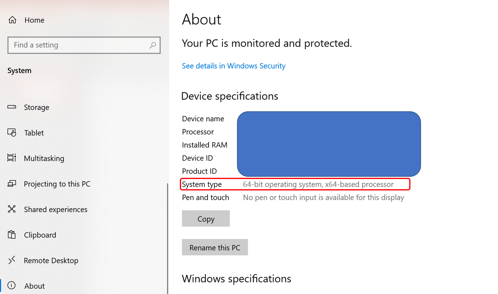
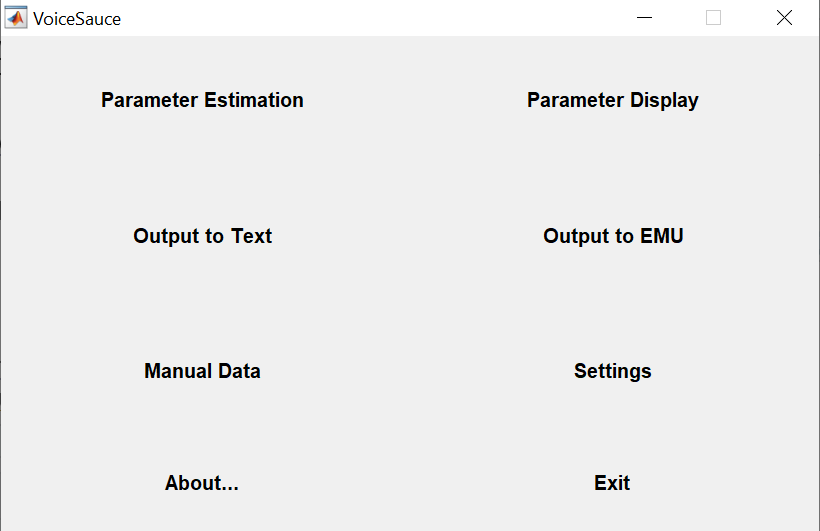
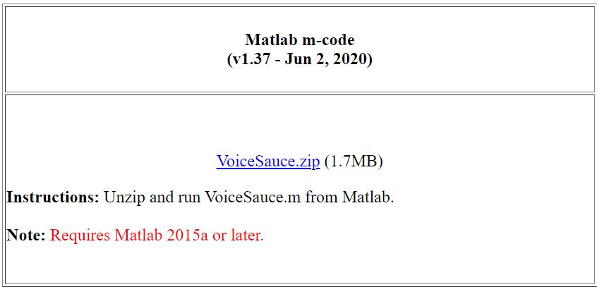
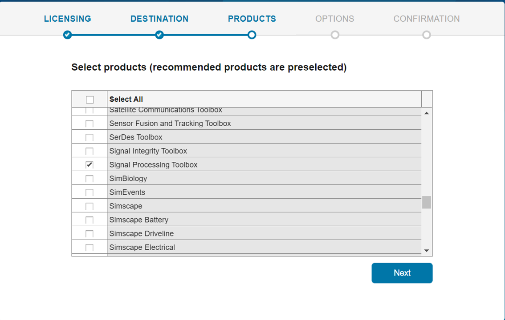
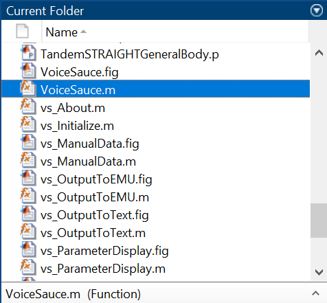
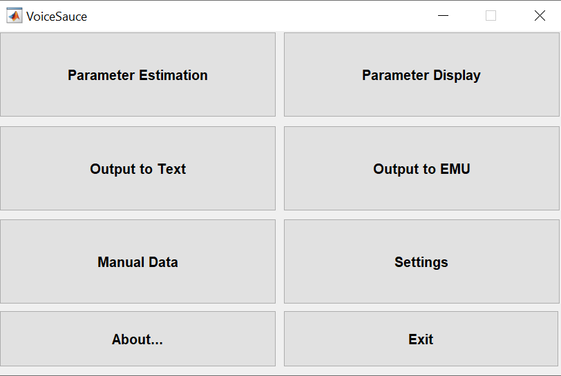
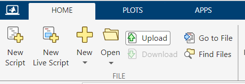

```{r setup, include=FALSE}
knitr::opts_chunk$set(echo = TRUE, warning = FALSE, message = FALSE, fig.width = 5, fig.height = 3, fig.align = "center")
library(ggplot2)
library(dplyr)
library(ggforce)
library(ggpubr)
library(scales)
library(reshape2)
```

# To install VoiceSauce

To access the full features of VoiceSauce, please download VoiceSauce.exe (Windows users) or Matlab (Mac users) following the instructions below. If you prefer not downloading softwares to your computer, you can go to Matlab online to access VoiceSauce with features limited to measuring F0, noise level, Energy, Amplitude of voicing.

## Windows users
1. Go to http://www.phonetics.ucla.edu/voicesauce/. Under "Compiled Matlab executables - Windows 7/10", click on Matlab Component Runtime and install the installer.exe<br>
<center>{width=50%}</center>
    + To find out whether your computer has 32-bit or 64-bit system, go to "Start" &#8594; "Settings" &#8594; "About". On the main page you will see "System type."<br>
<center>{width=50%}</center>
2. Download VoiceSauce_bin.zip, unzip the .zip folder, and click on VoiceSauce.exe to run the program.
<center>{width=40%}</center>

## Mac users

1. Go to http://www.phonetics.ucla.edu/voicesauce/. Under "Matlab m-code", click on "VoiceSauce.zip" to download it. After download, unzip the VoiceSauce into a regular folder.
<center>{width=50%}</center>
2. Install Matlab so that we can open VoiceSauce in Matlab:
* Go to Matlab support at UHM: [here](https://www.mathworks.com/academia/tah-portal/university-of-hawaii-manoa-40591263.html). Click "Sign in to get started". Log in with your UH username and password.
    + New Users: Create a MathWorks Account. After entering your information, you will be sent an email to verify this account. Log in with your newly created MathWorks Account to download the software.
    + Returning users: Log in with your MathWorks Account information to download the software.
* After logging into your Matlab account, select "Install MATLAB".  Select "R2022b", click on "Download for macOS". Open "matlab_R2022b_maci64.dmg". The installation will start.
* At the step  of "Select products", select "MATLAB" and "Signal Processing Toolbox". Then proceed to the end of "Begin install".
<center>{width=50%}</center>
3. Open Matlab. Click on the rightmost icon at the address bar "Browse for folder". Navigate to the location where the VoiceSauce folder was stored. Select the VoiceSauce folder and click "Select folder".
<center>{width=30%}</center>
4. On the left, find "Current folder" panel, find "VoiceSauce.m" and double left-click on the file.
<center>{width=30%}</center>
5. The scripts show up in the Editor in the main panel. Under the tab of "EDITOR", click on "Run". The interface of VoiceSauce shows up.
<center>{width=70%}</center>
<center>{width=40%}</center>

## Online platform

* Note that the online platform cannot compute formants or harmonic amplitudes with formant correction.
1. Go to http://www.phonetics.ucla.edu/voicesauce/. Under "Matlab m-code", click on "VoiceSauce.zip" to download it.
<center>{width=50%}</center>
2. Go to Matlab support at UHM: [here](https://www.mathworks.com/academia/tah-portal/university-of-hawaii-manoa-40591263.html). Click "Sign in to get started". Log in with your UH username and password.
    + New Users: Create a MathWorks Account. After entering your information, you will be sent an email to verify this account. Log in with your newly created MathWorks Account to download the software.
    + Returning users: Log in with your MathWorks Account information to download the software.
3. After logging into your Matlab account, select "Open MATLAB Online". An online portal of Matlab opens.
4. Under "Home" tab, click on "Upload", navigate to the place where VoiceSauce.zip locates. Select VoiceSauce.zip.
<center>{width=40%}</center>
5. Under the left panel "Current Folder", double-click "VoiceSauce.zip" and unzip it. Click on the triangle besides the VoiceSauce folder to unfold it. Find "VoiceSauce.m" in the list and double click on it.
<center>{width=30%}</center>
6. Under the tab "Editor", click on "Run". If a prompt warns you that the script is not found in the path, select "Add to path". The interface of VoiceSauce shows up.
<center>{width=40%}</center>

# How to use VoiceSauce

1. Prepare your file: Put your audio file and TextGrid files in the same folder. The .Textgrid file should have the same name as its corresponding .wav file. Avoid any special characters (e.g. IPA symbols /ə, ɯ/, letters with accents /ä/). You can assign a different letter to the special characters and create a code sheet to keep a record of their correspondence. A sample folder with audio and Textgrid files can be found here.
2. Under "Common", change "Not a number label" as "NaN".
    + Other parameters that you can adjust:
        - F0: Max/Min F0
        - Formants: Praat Max formant freq; Number of formants;
        - Textgrid: Tier numbers (i.e. if you have multiple tiers in your Textgrid file, which tier you'd like to analyze.)
2. 
